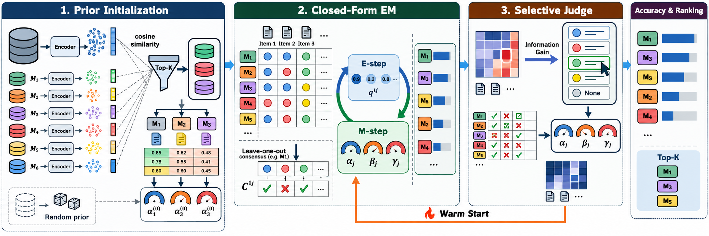
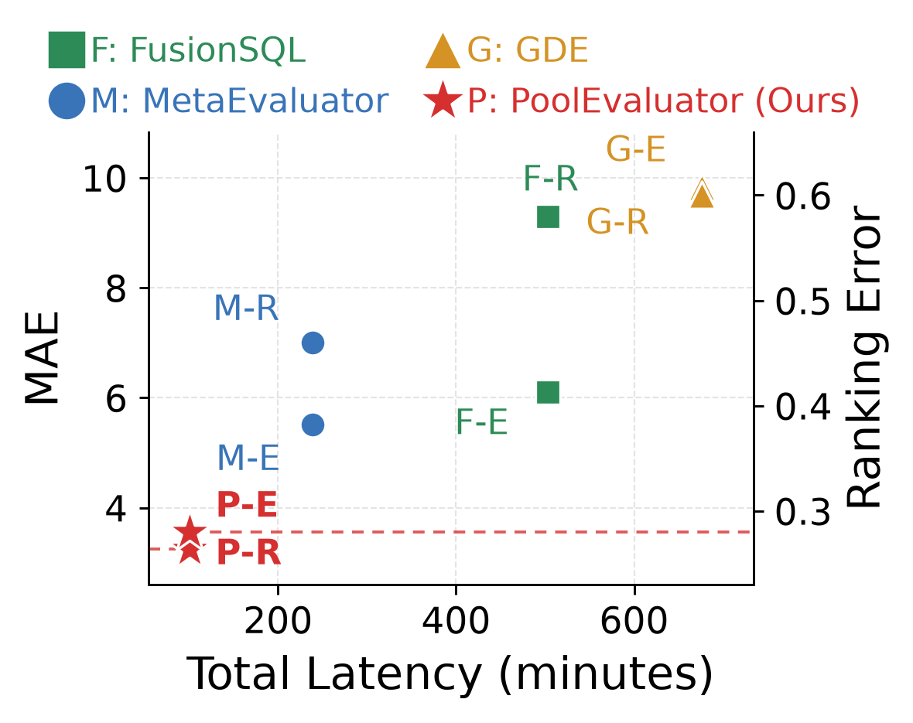

# PoolEvaluator

This is the paper-aligned artifact for **“Which Model Should Be Chosen? Evaluating a
Pool of Models on Unseen and Unlabeled Data.”** It jointly estimates and ranks models
from their agreement on an unlabeled target set, initializes the estimate from
retrieved labeled subsets, and optionally asks a small ensemble of external judges to
resolve ambiguous items.

The prior exploratory repository is preserved on the Git branch
`trinh_experiment`. `main` intentionally contains only the implementation needed to
run the method in the paper.





## What is included

- The exact appendix pool sizes: **35 Text2SQL**, **20 image-classification**, and
  **20 node-classification** members in [`manifests/`](manifests/).
- Lazy download/loading for Transformers, timm, PyTorch Geometric, zero-shot vision,
  and graph adapter/projector repositories in
  [`pooleval/models.py`](pooleval/models.py).
- Stage 1 top-K subset retrieval, Stage 2 closed-form EM over
  \((\alpha_j,\beta_j,\gamma_j)\), and Stage 3 warm-started judge validation.
- EX-Extended evaluation on the original SQLite database plus **five modified
  instances**, with deterministic caching and integrity checks.
- GPT-5.4, GPT-5.5, and Claude Opus 5.5 judge adapters and majority aggregation.
- One shell entry point for tests, dry-run model preparation, database generation,
  and full Spider/BIRD evaluation.

The two manuscript figures are committed as README assets. PDFs and exploratory
reports are deliberately absent from `main`; the paper itself remains the source of
truth for tables and derivations.

## 1. Create the environment

Python 3.10 or newer is required.

```bash
git clone <repository-url>
cd pool_text2sql_eval_code

python -m venv .venv
source .venv/bin/activate
python -m pip install --upgrade pip

# Core estimator, manifests, database tooling, and tests
python -m pip install -e '.[dev]'

# Add model runtimes and API clients on an experiment machine
python -m pip install -e '.[models,judges]'
```

`torch-geometric` may require a CUDA-specific wheel on older systems. Follow the
[PyG installation matrix](https://pytorch-geometric.readthedocs.io/en/latest/install/installation.html)
if the normal extra does not match the installed PyTorch/CUDA build.

## 2. Configure the datasets

The defaults match the local machine used for this artifact:

```text
/mnt/win_d/data_FusionSQL/
├── spider/
│   ├── sft_spider_dev_text2sql.json
│   ├── sft_spider_train_text2sql.json
│   ├── database/<db_id>/<db_id>.sqlite
│   └── test_database/<db_id>/<db_id>.sqlite

/mnt/win_d/data/
├── sft_bird_dev_text2sql.json
├── sft_bird_train_text2sql.json
└── sft_data_collections/bird/
    ├── dev/dev_databases/<db_id>/<db_id>.sqlite
    └── train/train_databases/<db_id>/<db_id>.sqlite
```

The path mentioned in the original notes was `/mnt/win_d/data_FuionsQL`; the
directory present on this machine is `/mnt/win_d/data_FusionSQL` (correct spelling).
Override any location with environment variables:

```bash
export POOLEVAL_DATA_ROOT=/path/to/data_FusionSQL
export BIRD_METADATA_ROOT=/path/to/bird/json/files
export BIRD_DATABASE_ROOT=/path/to/bird/database/root
export POOLEVAL_ARTIFACT_ROOT=/fast/disk/pooleval_artifacts
```

The loaders skip Git-LFS pointer stubs and require materialized SQLite files larger
than 4 KiB.

## 3. Inspect, download, and load the paper model pools

First inspect the complete manifests without downloading weights:

```bash
python -m pooleval.models list --task all
python -m pooleval.models download --task all --dry-run
```

Download one pool or all three. Gated repositories require a Hugging Face token and
license acceptance.

```bash
export HF_TOKEN=hf_...
python -m pooleval.models download --task text2sql --cache-dir checkpoints
python -m pooleval.models download --task image    --cache-dir checkpoints
python -m pooleval.models download --task node     --cache-dir checkpoints
# equivalent: --task all

# Clone the official GraphGPT, GraphPFN, and LLaGA runtime source trees.
python -m pooleval.models runtimes --task node --cache-dir checkpoints
```

Verify runtime loading sequentially (a loaded member is released before the next):

```bash
python -m pooleval.models load --task text2sql --cache-dir checkpoints
python -m pooleval.models load --task image    --cache-dir checkpoints
python -m pooleval.models load --task node     --cache-dir checkpoints
```

The large 70B/72B checkpoints need a multi-GPU machine. `device_map=auto` and
automatic dtype are used. `ModelPool.iter_load()` is the programmatic entry point;
[`pooleval/adapters.py`](pooleval/adapters.py) turns loaded members into Text2SQL,
image, or node predictions. The two LLaGA entries consist of a Vicuna base plus a
released projector. GraphGPT additionally downloads its released graph encoder.
GraphGPT, GraphPFN, and LLaGA retain their official runtimes because their custom graph
types are not supported by Transformers `AutoModel`. They enter the common adapter via
`graph.external_runner(checkpoint, graph, class_names)`. GraphPFN's public repository
contains graph-adapter weights, but its required LimiX backbone has a separate license;
obtain that backbone under its upstream terms before running GraphPFN. Local checkpoint
paths are retained in `LoadedModel.local_path`.

## 4. Create EX-Extended database instances

Build five modified instances for **every unique database** referenced by both target
sets:

```bash
python -m pooleval.databases \
  --dataset all \
  --split target \
  --output-dir artifacts/db_instances
```

For a cheap validation first:

```bash
python -m pooleval.databases --dataset spider --limit-databases 1 --output-dir artifacts/db_smoke
python -m pooleval.databases --dataset bird   --limit-databases 1 --output-dir artifacts/db_smoke
```

Each source database gets `instance_1.sqlite` through `instance_5.sqlite` plus a JSON
manifest. The variants make deterministic value replacements, deletions, and
insertions, then run `PRAGMA integrity_check`. Source databases are opened read-only
by the evaluator and are never modified.

## 5. Configure the judge ensemble

Set the provider credentials before enabling Stage 3:

```bash
export OPENAI_API_KEY=...
export ANTHROPIC_API_KEY=...
```

GPT-5.4 and GPT-5.5 use the OpenAI Responses API with strict JSON-schema output.
Claude Opus 5.5 uses Anthropic’s Messages API. An OpenAI key cannot authenticate to
Anthropic, so `ANTHROPIC_API_KEY` is required for the requested three-member ensemble.
By default a missing provider is reported and the available judges continue; pass
`--require-all-judges` for strict three-member behavior.

The manuscript draft names Claude Opus 4.5, whereas this artifact intentionally uses
**Claude Opus 5.5** as requested. The configured model IDs are `gpt-5.4`, `gpt-5.5`,
and `claude-opus-5-5`.

## 6. Run PoolEvaluator

Run the CPU-only estimator smoke test:

```bash
python -m pooleval.pipeline smoke
```

Run a small real Spider experiment using two target items and a subset of models:

```bash
python -m pooleval.pipeline text2sql \
  --dataset spider \
  --target-items 2 \
  --source-candidates 100 \
  --max-models 3 \
  --checkpoint-dir checkpoints
```

Enable judge refinement by adding `--judge`. Predictions, modified databases, and
reports are cached under `artifacts/`, so interrupted runs are resumable.

The Text2SQL execution path is:

1. Group labeled calibration examples by database, embed their questions, and
   retrieve the top `K=15` subsets by cosine similarity.
2. Run each pool member lazily on calibration and target prompts.
3. Execute every SQL answer on the original database and five variants. Two answers
   agree only if their canonical results agree on all six instances.
4. Compute leave-one-model-out consensus and initialize
   \(\alpha,\beta,\gamma\) from the retrieved labeled subsets.
5. Run closed-form EM until the infinity-norm change is below `1e-6`.
6. For `V=10` rounds, select the item with the largest posterior entropy, ask the
   judge ensemble, hard-fix the revealed correctness vector, and warm-start EM.
7. Write estimated accuracies, ranking, true held-out EX-Extended metrics, and run
   metadata to `artifacts/<dataset>_report.json`.

Gold SQL is used only to compute calibration priors and post-hoc evaluation metrics;
it is never included in a target model prompt or judge prompt.

## 7. Run everything from one script

The default is a safe smoke run: unit tests, all model-manifest checks, a download
plan, estimator inference, and one real Spider plus one real BIRD database-instance
test.

```bash
bash scripts/run_all.sh
```

The full paper-scale Text2SQL run uses all 35 models, 150 target items per dataset,
top-15 retrieved subsets, EX-Extended, and ten judge rounds:

```bash
MODE=full \
DOWNLOAD_MODELS=1 \
PREPARE_EXTERNAL_RUNTIMES=1 \
RUN_JUDGES=1 \
REQUIRE_ALL_JUDGES=1 \
bash scripts/run_all.sh
```

Useful controls:

```bash
TARGET_ITEMS=10          # target examples per dataset
SOURCE_CANDIDATES=500    # calibration records considered before top-K retrieval
MAX_MODELS=5             # prefix of the 35-member Text2SQL manifest
DOWNLOAD_MODELS=0        # reuse existing checkpoints
PREPARE_EXTERNAL_RUNTIMES=0 # clone official custom graph-model code
RUN_JUDGES=0             # stop after Stage 2
LOAD_ALL_POOLS=1         # additionally load all Text2SQL/image/node members in sequence
DB_SMOKE_LIMIT=2         # databases per dataset in the initial database smoke test
```

Running the entire appendix pools requires the corresponding image and graph datasets
and class mappings. Load those datasets in the standard torchvision/PyG form, then
call `predict_images()` or `predict_nodes()` from `pooleval.adapters`; both return the
`[items]` label vector consumed by the same `PoolEvaluator.fit()` API.

## 8. Tests and repository map

```bash
python -m pytest -q
```

```text
assets/                  paper figures used above
configs/paper.yaml       K, V, EM, execution, paths, and judge defaults
manifests/               all appendix model pools
pooleval/estimator.py    leave-one-out agreement and closed-form EM
pooleval/retrieval.py    top-K meta-subset retrieval
pooleval/databases.py    five-instance SQLite generator
pooleval/execution.py    read-only SQL and EX-Extended equivalence
pooleval/models.py       checkpoint download and lazy loading
pooleval/adapters.py     Text2SQL/image/node prediction adapters
pooleval/judges.py       three-model judge ensemble
pooleval/pipeline.py     end-to-end orchestration
scripts/run_all.sh       smoke and full reproduction entry point
tests/                   deterministic unit and integration tests
```

To inspect the exploratory history without changing `main`:

```bash
git switch trinh_experiment
```
